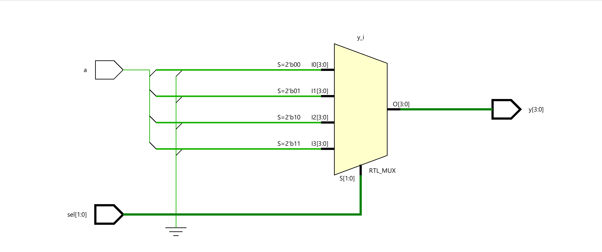
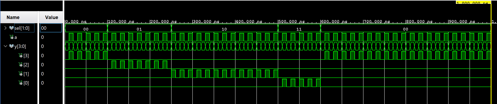
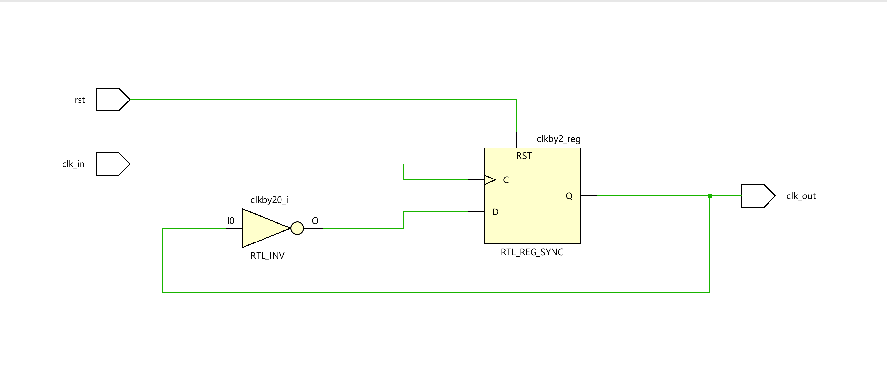
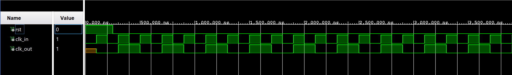
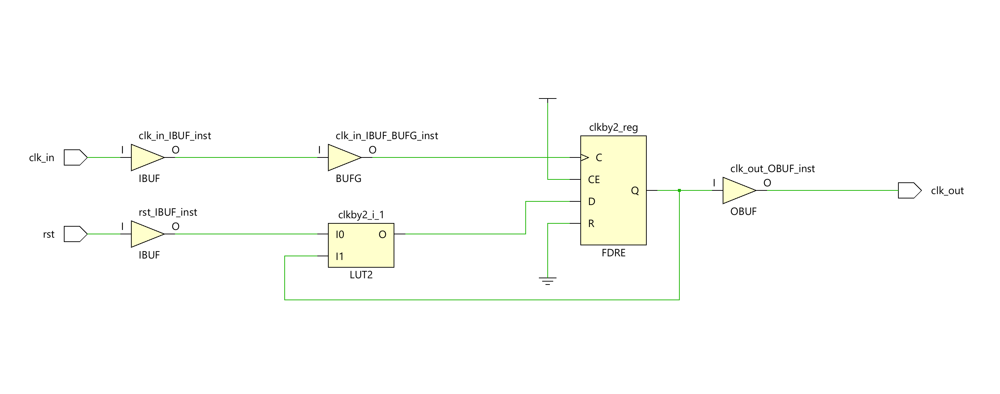
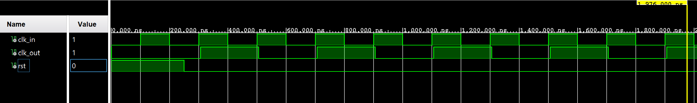
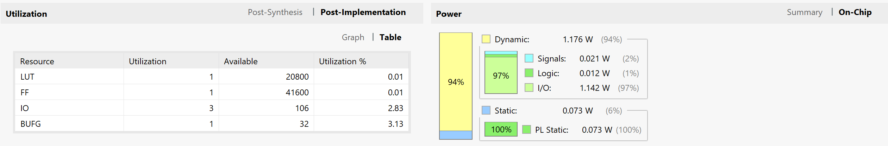

# HDL_Basic_Circuits
 This is the repository of some digital system circuits coded in HDL, both in VHDL and Verilog, starting from the basic level and continuing to a little advanced level.

These circuits are presented as some Lab assignment questions, and I have implemented them in the [Digilent Cmod A7](https://digilent.com/reference/programmable-logic/cmod-a7/start) board.

-------------------
## 1. Demultiplexer
Write HDL code to realize a 4 bit, 1 to 4 demultiplexer. Make the outputs “0000” when not selected.
1. Write the architecture using equations.
2. Write the architecture in dataflow model using (with ... select) construct.

### Code: 
   - [VHDL Code](dmux_4bit.vhd)
   - [TestBench](dmux_4bit_tb.vhd)
   
### Functional Simulation:
   - Schematic:
   

   - Waveform:
   

### Synthesis:

### Implementation:
   
3. Write the behavioral code using (case ... when ...) construct.

----------------------
## 2. Priority Encoder
Write HDL code to implement a 3-input priority encoder. Encode output as “00” when none of the inputs are asserted.
1. Write the architecture in dataflow model using (when ... else) construct.
2. Write the behavioral code using (if ... then ...) construct.

--------------------------------
## 3. 2-bit Magnitude Comparator
Write HDL code to realize a 2-bit Magnitude Comparator. Input to the circuits are two unsigned 2-bit numbers. There are three outputs: 'greater than', 'equal' and 'less than'.
1. Write the architecture in dataflow model using (with ... select) construct.
2. Write the behavioral code using (case ... when) construct.

--------------------------------
## 4. 4-bit Magnitude Comparator
Write HDL code to implement a 'Greater Than' magnitude comparator of two unsigned 4-bit numbers. Implement this from scratch using bit level logic function.
1. Write the architecture in dataflow model using (when ... else) construct.
2. Write the architecture in dataflow model using equations.
3. Write the behavioral code using (if ... then ...) construct.

-------------------------
## 5. Decrementer Circuit
Write HDL code of a decrementer (-1) circuit for an unsigned 4-bit number in following two ways. Compare the area (resource utilization) and performance (delay) in each case.
1. Implement using structural code as a cascade of basic blocks in bit level.
2. Implement using the operator '-' in 'ieee.std_logic_unsigned' package.

-------------------
## 6. Clock Divider
Write HDL code to divide the frequency of a clock by 2.

### Code: 
   - [VHDL Code](clk_div_by2.vhd)
   - [TestBench](clk_div_by2_tb.vhd)
   
### Functional Simulation:
   - Schematic:
   

   - Waveform:
   

### Synthesis:
   - Schematic:
   

   - Waveform (Timing Simulation):
   :
   

   - Report (Utilisation & Power):
   

-------------------
## 7. Clock Divider (generic)
Write HDL code to divide the frequency of a clock by a multiple of 2 (generic).

-------------------
## 8. Floating Point Normalizer
Design a normalizing circuit for de-normal floating point numbers. Assume 16-bit size for the mantissa, including the leading 1. Mantissa of normalized floating point would be read 1.xxx...xx (x: 0 or 1).
Assume that a de-normalized number is available in one register; after de-normalizing the number, the result is loaded into another register. Assume registers get the same clock. Design the circuit so that the shifting can be done in the same amount of time, irrespective of where leading 1 appears. Also, output the value to be subtracted from the exponent to a port to be used by the exponent circuit.

An example of a de-normalized floating point would be 0.00001xx..xxx (x:0 or 1). This number is normalised by shifting the number left by 5 places.

-------------------
## 9. Signed 8-bit Radix-4 Booth Recorded Array Multiplier
Design and implement a signed 8-bit Radix-4 Booth Recorded Array Multiplier (all partial products are generated and added concurrently) using VHDL code. 
1. Do the structural coding using components for booth recording. Partial products can be added using the built-in operator '+' that would use Carry Propagate Adder resources within FPGA.
2. Do the pipelining of the above design for maximum throughput. Structural coding can be used as well as behavioural coding (using process). Pipelined registers can be implemented using behavioural code.
